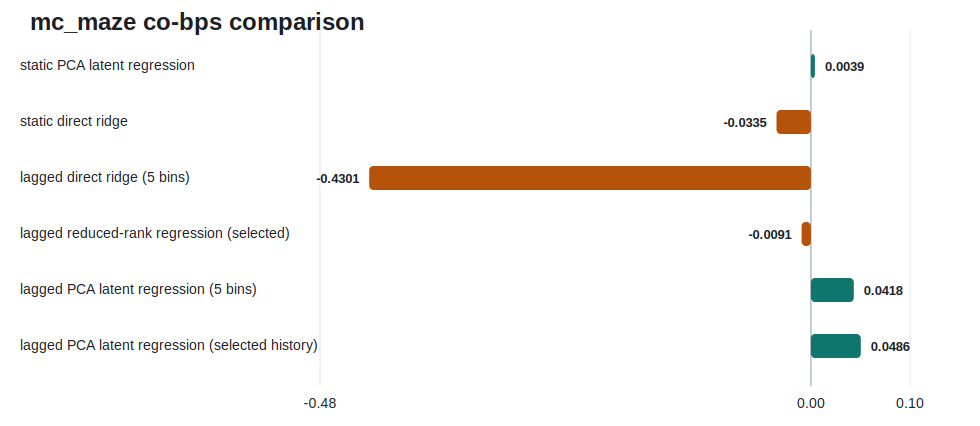
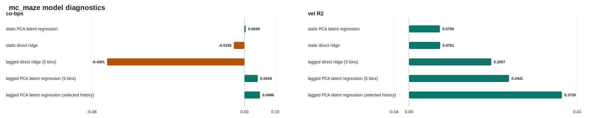

# Neural Latents Benchmark (`mc_maze`) Analysis

[](https://github.com/cabe9/NLBProject/actions/workflows/ci.yml)

This repository trains lightweight linear and latent models on the Neural Latents Benchmark (`NLB'21`) `mc_maze` dataset to predict held-out neural firing rates from held-in population activity.

It uses the official `nlb_tools` tensor-building and evaluation path, scores models with `co-bps` plus `vel R2` / `psth R2`, and writes tracked metrics tables and comparison figures under `results/`.

The strongest validated result in the repo is a **lagged PCA latent regression** model, which improves materially over the original static PCA baseline without changing the benchmark protocol.

## Project goal

The central modeling question was:

> Does short-timescale neural history matter more than static latent dimensionality for `mc_maze` co-smoothing?

The current evidence in this repo says yes.

Static PCA was weak. Static direct ridge was worse. Lagged direct ridge added temporal context but overfit the expanded feature space. Lagged PCA improved because it added short neural history and compressed that history before regressing to held-out neurons.

## Benchmark and evaluation path

The pipeline preserves the official NLB workflow:
1. load NWB data through `nlb_tools.nwb_interface.NWBDataset`
2. build train/eval tensors with `nlb_tools.make_tensors`
3. generate held-out rate predictions
4. evaluate with `nlb_tools.evaluation.evaluate`

Primary metric:
- `co-bps`

Secondary metrics:
- `vel R2`
- `psth R2` when available

What this repo does **not** change:
- benchmark splits
- metric definitions
- evaluation code
- data-loading conventions

## Best validated model

Active config:
- `configs/mc_maze_lagged_pca.yaml`

Model family:
- `lagged_pca_latent_regression`

Reference configuration:
- `history_bins=5`
- `n_components=20`
- `ridge_alpha=0.1`
- `input_transform=sqrt_zscore`

Selected configuration:
- `history_bins=9`
- `n_components=20`
- `ridge_alpha=0.1`
- `input_transform=sqrt_zscore`

Canonical saved outputs:
- `results/mc_maze/metrics.csv`
- `results/mc_maze/ablation.csv`
- `results/mc_maze/summary.md`

## Models compared

The repo includes these lightweight model families:
- `smoothing`
- `pca_latent_regression`
- `ridge_direct`
- `lagged_ridge_direct`
- `lagged_pca_latent_regression`

The portfolio comparison is intentionally narrow and reproducible:
- static PCA latent regression
- static direct ridge
- lagged direct ridge (5 bins)
- lagged PCA latent regression (5 bins)
- lagged PCA latent regression (selected history)

Generated comparison artifacts:
- `results/benchmark_runs/model_comparison.csv`
- `results/benchmark_runs/model_comparison.md`
- `results/benchmark_runs/model_comparison.svg`
- `results/benchmark_runs/model_diagnostics.svg`
- `results/benchmark_runs/experiment_log.md`

Tracked benchmark source metrics used for regeneration:
- `results/benchmark_runs/static_pca/metrics.csv`
- `results/benchmark_runs/static_ridge/metrics.csv`
- `results/benchmark_runs/lagged_ridge_single/metrics.csv`
- `results/benchmark_runs/lagged_pca_single/metrics.csv`
- `results/benchmark_runs/lagged_pca_history_sweep/metrics.csv`

The metric values in those artifacts are regenerated from those tracked `metrics.csv` files. The only manual layer is the small comparison manifest in `src/nlb_project/reporting.py`, which decides which saved run row to display and how to label it.

## Key result

The checked-in comparison artifacts are generated from tracked benchmark `metrics.csv` files under `results/benchmark_runs/`.

Headline result:
- in the tracked comparison set, the selected lagged PCA model is the strongest `co-bps` result and also improves `vel R2` over the static baselines

Quick visual:



Diagnostic panel:



Skimmable table:
- `results/benchmark_runs/model_comparison.md`

Main takeaway:
- temporal context mattered much more than static latent dimensionality alone
- temporal context by itself was not enough; the lagged design needed latent compression
- the diagnostic panel shows why: lagged direct ridge improved `vel R2` but hurt `co-bps`, while lagged PCA improved both

## Why this matters for neural decoding

This is a small but defensible neural population modeling result:
- held-out neuron prediction benefits from recent population history
- the useful structure is easier to exploit after low-dimensional compression
- a simple, interpretable latent model can improve benchmark performance without moving to heavyweight deep learning

That makes the repo useful as a portfolio project: it shows benchmark discipline, model diagnosis, and an interpretable improvement rather than a framework-heavy rewrite.

## How to reproduce

Environment:

```bash
conda create -n nlb python=3.10
conda activate nlb
make setup
```

Data:

```bash
python -m scripts.get_data --dataset mc_maze --out data/raw
export NLB_DATA_DIR=$(pwd)/data/raw
```

The downloader is pinned to a stable DANDI release for `mc_maze`, not the floating `draft` URL.

Run the validated lagged PCA experiment:

```bash
make run
```

Equivalent command:

```bash
python -m scripts.run_experiment --config configs/mc_maze_lagged_pca.yaml
```

Regenerate the comparison artifacts and figure from saved metrics:

```bash
make portfolio-artifacts
```

Run tests:

```bash
make test
```

## Repo layout

- `src/nlb_project/pipeline.py`: experiment orchestration
- `src/nlb_project/models/`: model implementations
- `src/nlb_project/models/lagged_pca_latent_regression.py`: strongest validated model
- `src/nlb_project/models/temporal_features.py`: lagged feature construction and train-only preprocessing
- `src/nlb_project/reporting.py`: portfolio artifact generation from saved metrics
- `scripts/run_experiment.py`: main CLI entrypoint
- `scripts/generate_portfolio_artifacts.py`: rebuilds comparison CSV/Markdown/SVG from saved result files
- `configs/benchmarks/`: small benchmark configs used to build the comparison set
- `tests/`: unit and smoke tests

## Data path contract

The runner resolves data from either:
1. `data_path` in the config
2. `NLB_DATA_DIR` plus a dataset-specific default subpath

For `mc_maze`, the expected default layout is:

```bash
$NLB_DATA_DIR/000128/sub-Jenkins
```

The pipeline validates the expected NWB pattern:

```bash
<resolved_data_path>/<data_prefix>*.nwb
```

## Limitations / next step

Current limitations:
- only one dataset is fully packaged in this repo surface
- the comparison set is intentionally small
- the best model is still linear and not yet a dynamical latent model

Most justified next step:
- add reduced-rank regression on top of the same lagged feature pipeline

That would test whether the gain is coming mainly from temporal context, from the PCA bottleneck specifically, or from low-rank structure more generally.
