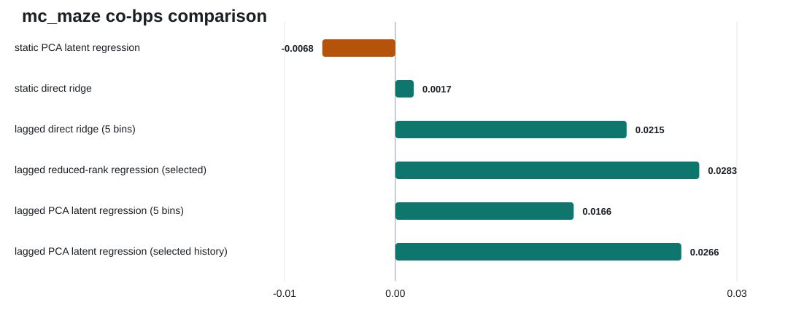

# Neural Latents Benchmark (`mc_maze`) — reproducible public-test neural baseline

[](https://github.com/cabe9/NLBProject/actions/workflows/ci.yml)

This repo packages a small, reproducible Neural Latents Benchmark workflow for NLB'21 `mc_maze`. The linear baseline shows why short neural history matters; the NDT-lite transformer path now reaches `0.2481 co-bps` on the local public-test target with a 3-seed ensemble, all scored through the official `nlb_tools` evaluation code.

## Start here in 10 minutes

If you're new to this repo, run this quick, safe path first:

> Supported Python version: **3.10 only**. Python 3.11+ is not currently supported because `nlb-tools==0.0.4` depends on `pandas<=1.3.4`.

1. Create and activate an environment, then install deps:

```bash
conda create -n nlb python=3.10 -y
conda activate nlb
make setup
```

2. Run a minimal CI-safe pipeline wiring check (no dataset download):

```bash
pytest -q tests/test_pipeline_integration.py
```

3. (Optional, full benchmark run) Fetch data and run the validated experiment:

```bash
nlb-get-data --dataset mc_maze --out data/raw
export NLB_DATA_DIR="$(pwd)/data/raw"
make run
```

`nlb-get-data` shells out to the DANDI CLI. If it reports that `dandi` is missing, install that downloader once with `python -m pip install dandi`.

4. (Optional, frozen-leaderboard comparison) Score the selected config against
   the public NLB test targets:

```bash
make public-eval-data
make public-test
```

This selects hyperparameters on the config's train/val split, then fits the
final public-test model on `train + val` to match the official target schema.
It writes local public-test artifacts under `results/public_test/mc_maze/`.
The target HDF5 is downloaded from the official `neurallatents/nlb_tools`
repo and verified by SHA-256; it is ignored by git.

For the neural public-test baseline, install the optional PyTorch dependency
and run:

```bash
python -m pip install -e '.[dev,neural]'
nlb-evaluate-public-test \
  --config configs/benchmarks/mc_maze_ndt_lite_ensemble.yaml \
  --output-dir results/public_test/mc_maze_ndt_lite_ensemble
```

Where outputs appear:

- Test-only integration artifacts are created under a temporary test directory.
- Full experiment artifacts appear in `results/mc_maze/` (`metrics.csv`, `ablation.csv`, `summary.md`, `run_metadata.json`, and `predictions/*.h5`). `run_metadata.json` captures the config path, git revision/dirty state, Python/package versions, resolved data path, and prediction file hashes.
- Portfolio comparison artifacts live in `results/benchmark_runs/` and can be regenerated with `make portfolio-artifacts`.

What success looks like:

- `pytest` exits with `1 passed` for `tests/test_pipeline_integration.py`.
- A full run prints reference/selected `co-bps` and writes files under `results/mc_maze/`.
- `make portfolio-artifacts` finishes with no diff in tracked files when nothing changed scientifically.

## Results at a glance

Scored under the `log_link` rate readout on the `mc_maze` train/val split. Full table: [`results/benchmark_runs/model_comparison.md`](results/benchmark_runs/model_comparison.md). Source `metrics.csv` files: [`results/benchmark_runs/`](results/benchmark_runs/). Notebook walkthrough: [nbviewer render](https://nbviewer.org/github/cabe9/NLBProject/blob/master/notebooks/results_walkthrough.ipynb) ([source notebook](notebooks/results_walkthrough.ipynb)).

| Model | Role | co-bps | vel R² |
|---|---|---:|---:|
| static PCA latent regression | reference | −0.0068 | 0.0756 |
| static direct ridge | reference | 0.0017 | 0.0769 |
| lagged direct ridge (5 bins) | reference | 0.0215 | 0.1986 |
| lagged reduced-rank regression (selected) | selected | 0.0283 | 0.2316 |
| lagged PCA latent regression (5 bins) | reference | 0.0166 | 0.2400 |
| **lagged PCA latent regression (selected history)** | **headline** | **0.0266** | **0.3648** |



### Public-test score

Local evaluation against the public NLB test target HDF5:

| Model | co-bps | vel R² | psth R² |
|---|---:|---:|---:|
| lagged PCA latent regression, selected history | 0.0268 | 0.3678 | -26.4081 |
| NDT-lite temporal transformer | 0.2338 | 0.6412 | 0.3397 |
| **NDT-lite, 3-seed ensemble** | **0.2481** | **0.6589** | **0.4086** |

**Takeaways**

- Every lagged model beats every static model on `co-bps`. Temporal context dominates static latent dimensionality.
- RRR and lagged PCA tie on `co-bps` within `~0.002`. The discriminator is `vel R²`, where lagged PCA's unsupervised bottleneck captures more behaviour-aligned structure.
- An earlier version of this repo reported `lagged_ridge_direct ≈ −0.43 co-bps`; that number was a clipped-Gaussian rate-readout artefact, not a model failure. Full writeup: [`docs/output_head_postmortem.md`](docs/output_head_postmortem.md).

### Headline model config

Config: [`configs/mc_maze_lagged_pca.yaml`](configs/mc_maze_lagged_pca.yaml) · family: `lagged_pca_latent_regression` · readout: `log_link` (`log_offset=0.001`) · input transform: `sqrt_zscore` · `n_components=20` · `ridge_alpha=0.1` · `history_bins`: `5` (reference) → `9` (selected).

## Reproduce in 5 commands

```bash
conda create -n nlb python=3.10 && conda activate nlb
make setup
nlb-get-data --dataset mc_maze --out data/raw && export NLB_DATA_DIR=$(pwd)/data/raw
make run                 # runs the validated lagged PCA experiment; writes results/mc_maze/
make portfolio-artifacts # rebuilds comparison CSV / Markdown / SVG from tracked metrics
```

`make test` / `make lint` / `make format` / `make verify-results` / `make notebook` for the dev loop. `make verify-results` checks that tracked metrics and comparison CSVs are internally consistent, and verifies local `run_metadata.json` / prediction hashes when those full-run artifacts are present. `make public-test` is the local analogue of the frozen EvalAI test score. `nlb-get-data` is pinned to a stable DANDI release for `mc_maze`, not the floating `draft` URL.

### Data layout

The runner resolves the NWB path from either `data_path` in the config, or from `NLB_DATA_DIR` plus a dataset-specific default. For `mc_maze` the expected layout is `$NLB_DATA_DIR/000128/sub-Jenkins/*.nwb`, validated at startup.

## Start here, not in source

- **[Results walkthrough notebook](https://nbviewer.org/github/cabe9/NLBProject/blob/master/notebooks/results_walkthrough.ipynb)** — rendered walkthrough of the comparison table and plots (90-second skim); source: [`notebooks/results_walkthrough.ipynb`](notebooks/results_walkthrough.ipynb).
- **[`docs/architecture.md`](docs/architecture.md)** — pipeline diagram and stage-by-stage control flow.
- **[`docs/models.md`](docs/models.md)** — one-paragraph description of each model family.
- **[`docs/output_head_postmortem.md`](docs/output_head_postmortem.md)** — how a clipped rate readout silently rewrote the scientific narrative, and how it was fixed.

## Repo layout

```
configs/               experiment YAML configs (benchmark suite + the selected config)
docs/                  architecture notes, model descriptions, output-head postmortem
notebooks/             results_walkthrough.ipynb — rendered comparison
results/               tracked per-run metrics.csv + portfolio comparison artifacts
scripts/               backward-compatible wrappers for the installed nlb-* commands
src/nlb_project/
  cli/                 installed nlb-* command implementations
  config.py            typed, fail-fast config loading
  model_registry.py    declarative ModelSpec entries; single source of truth for sweeps
  pipeline.py          orchestration: load → tensors → fit → head → evaluate → artifacts
  public_test.py       local evaluation against the public NLB test target file
  models/              fit_predict_* implementations (one file per family) + output_head
  reporting.py         deterministic rebuild of portfolio comparison artifacts
tests/                 pytest suite (shape, CV, config, data contract, smoke)
```

## Benchmark discipline

What this repo does **not** change:

- benchmark splits
- metric definitions
- evaluation code (handed off to `nlb_tools.evaluation.evaluate`)
- data-loading conventions (uses `nlb_tools.nwb_interface.NWBDataset` + `nlb_tools.make_tensors`)

See [`docs/architecture.md`](docs/architecture.md) for the full pipeline.

## Limitations and next step

- Only one dataset (`mc_maze`) is fully packaged here; the comparison set is intentionally small.
- The neural path is still a compact NDT-style baseline, not a full reproduction of the strongest NLB leaderboard systems.
- The public-test target is local and reproducible because EvalAI submissions are closed; it should be treated as a frozen benchmark artifact, not a live leaderboard submission.

Most justified next step for a measurable achievement: push the NDT-lite path above `0.25 co-bps` through validation-led tuning, then work toward old NDT-class `>0.32 co-bps`. See [`docs/respectable_score_plan.md`](docs/respectable_score_plan.md).

## Citation

```bibtex
@software{telander_nlb_project,
  author  = {Caleb Telander},
  title   = {Neural Latents Benchmark (mc_maze) Analysis},
  year    = {2026},
  url     = {https://github.com/cabe9/NLBProject}
}
```

The underlying benchmark and evaluation code come from [`nlb_tools`](https://github.com/neurallatents/nlb_tools); please also cite the Neural Latents Benchmark if you use these results.

## License

[MIT](LICENSE).

<!--
Suggested GitHub topics (set via the repo "About" gear on GitHub, not in-file):
  neuroscience
  machine-learning
  neural-decoding
  time-series
  reproducibility
  benchmarking
-->
