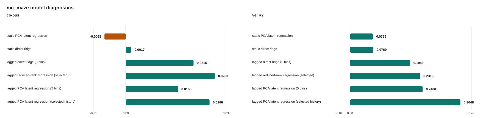

# Neural Latents Benchmark (`mc_maze`) Analysis

[](https://github.com/cabe9/NLBProject/actions/workflows/ci.yml)

This repository trains lightweight linear and latent models on the Neural Latents Benchmark (`NLB'21`) `mc_maze` dataset to predict held-out neural firing rates from held-in population activity.

It uses the official `nlb_tools` tensor-building and evaluation path, scores models with `co-bps` plus `vel R2` / `psth R2`, and writes tracked metrics tables and comparison figures under `results/`.

Under the repo's default `log_link` rate readout, two lagged models tie on `co-bps` (lagged reduced-rank regression at 0.028, lagged PCA at 0.027), with **lagged PCA winning decisively on `vel R2`** (0.36 vs 0.23). The reported "best validated model" is the lagged PCA row because it produces the more behaviourally-structured latent while matching RRR on co-smoothing.

## Project goal

The central modeling question was:

> Does short-timescale neural history matter more than static latent dimensionality for `mc_maze` co-smoothing?

The current evidence in this repo says yes. Every lagged model beats every static model on `co-bps`, regardless of whether the latent structure is imposed by PCA, a supervised low-rank regression, or omitted entirely.

Static PCA and static direct ridge both sit near zero co-bps. Adding short neural history moves every lagged model into positive co-bps territory. Among the lagged variants, PCA and supervised reduced-rank regression finish within 0.002 co-bps of each other; the distinction shows up on `vel R2`, where lagged PCA's bottleneck captures more behavioural structure.

### A note on the scientific narrative

An earlier version of this repo reported a much larger gap between lagged PCA and lagged direct ridge (0.049 vs -0.43 co-bps), and concluded that supervised reduced-rank regression failed to recover the PCA gain. Those numbers were produced under a Gaussian-ridge rate readout whose predictions were clipped to `[1e-9, 1e20]` before Poisson scoring; the `-0.43` figure was almost entirely a clip-floor artefact, not a model failure. After fixing the readout (see `src/nlb_project/models/output_head.py` and `results/benchmark_runs/output_head_comparison_3heads.json`), the gap between lagged direct ridge, RRR, and lagged PCA on co-bps compresses to ~0.01–0.02, and the remaining signal lives on `vel R2`. The pre-fix numbers are preserved in the three-head comparison artifact for reference.

## Benchmark and evaluation path

The pipeline preserves the official NLB workflow:
1. load NWB data through `nlb_tools.nwb_interface.NWBDataset`
2. build train/eval tensors with `nlb_tools.make_tensors`
3. generate held-out rate predictions
4. evaluate with `nlb_tools.evaluation.evaluate`

Primary metric:
- `co-bps`

Secondary metrics:
- `vel R2`
- `psth R2` when available

What this repo does **not** change:
- benchmark splits
- metric definitions
- evaluation code
- data-loading conventions

## Best validated model

Active config:
- `configs/mc_maze_lagged_pca.yaml`

Model family:
- `lagged_pca_latent_regression`

Reference configuration:
- `history_bins=5`
- `n_components=20`
- `ridge_alpha=0.1`
- `input_transform=sqrt_zscore`
- `output_head=log_link`
- `log_offset=0.001`

Selected configuration:
- `history_bins=9`
- `n_components=20`
- `ridge_alpha=0.1`
- `input_transform=sqrt_zscore`
- `output_head=log_link`
- `log_offset=0.001`

### Rate readout (`output_head`)

All regression models share a pluggable rate readout defined in
`src/nlb_project/models/output_head.py`. The default is `log_link`: ridge
regression is fit on `log(count + log_offset)` and predictions are
exponentiated at inference, guaranteeing strictly positive rates. This is
the co-bps-correct default.

The legacy `linear` head (Gaussian ridge on raw counts, clipped at `1e-9`)
is retained for ablations only. To reproduce the old numbers, add
`output_head: linear` to the `baseline` and `improvement` sections of a
config. Runs record the effective head in `run_metadata.json`.

Canonical saved outputs:
- `results/mc_maze/metrics.csv`
- `results/mc_maze/ablation.csv`
- `results/mc_maze/summary.md`

## Models compared

The repo includes these lightweight model families:
- `smoothing`
- `pca_latent_regression`
- `ridge_direct`
- `lagged_ridge_direct`
- `lagged_reduced_rank_regression`
- `lagged_pca_latent_regression`

The portfolio comparison is intentionally narrow and reproducible:
- static PCA latent regression
- static direct ridge
- lagged direct ridge (5 bins)
- lagged reduced-rank regression (selected)
- lagged PCA latent regression (5 bins)
- lagged PCA latent regression (selected history)

Generated comparison artifacts:
- `results/benchmark_runs/model_comparison.csv`
- `results/benchmark_runs/model_comparison.md`
- `results/benchmark_runs/model_comparison.svg`
- `results/benchmark_runs/model_diagnostics.svg`
- `results/benchmark_runs/experiment_log.md`

Tracked benchmark source metrics used for regeneration:
- `results/benchmark_runs/static_pca/metrics.csv`
- `results/benchmark_runs/static_ridge/metrics.csv`
- `results/benchmark_runs/lagged_ridge_single/metrics.csv`
- `results/benchmark_runs/lagged_rrr_sweep/metrics.csv`
- `results/benchmark_runs/lagged_pca_single/metrics.csv`
- `results/benchmark_runs/lagged_pca_history_sweep/metrics.csv`

The metric values in those artifacts are regenerated from those tracked `metrics.csv` files. The only manual layer is the small comparison manifest in `src/nlb_project/reporting.py`, which decides which saved run row to display and how to label it.

## Key result

The checked-in comparison artifacts are generated from tracked benchmark `metrics.csv` files under `results/benchmark_runs/`.

Headline result:
- every lagged model beats every static model on `co-bps`; the best static row (static direct ridge, 0.0017) is an order of magnitude below the worst lagged row (lagged PCA 5-bin, 0.0166)
- among lagged models, RRR (selected) and lagged PCA (selected history) tie on `co-bps` (0.0283 vs 0.0266), but lagged PCA pulls ahead on `vel R2` (0.365 vs 0.232)
- the selected-history lagged PCA row is reported as the headline validated model because it offers the best `co-bps` / `vel R2` balance on this benchmark slice

Quick visual:


Diagnostic panel:



Skimmable table:
- `results/benchmark_runs/model_comparison.md`

Main takeaway:
- temporal context mattered much more than static latent dimensionality alone
- on `co-bps` alone, supervised low-rank regression (RRR) is statistically indistinguishable from PCA compression once history is included
- the useful discriminator between lagged models is `vel R2`, not `co-bps`: lagged PCA's unsupervised bottleneck captures more behaviourally-aligned structure than either raw lagged ridge or supervised RRR
- all six rows are scored under the `log_link` readout; the three-head ablation in `results/benchmark_runs/output_head_comparison_3heads.json` shows how much of the old narrative was driven by the legacy clipped-Gaussian readout

## Why this matters for neural decoding

This is a small but defensible neural population modeling result:
- held-out neuron prediction benefits from recent population history
- the useful structure is easier to exploit after low-dimensional compression
- a simple, interpretable latent model can improve benchmark performance without moving to heavyweight deep learning

That makes the repo useful as a portfolio project: it shows benchmark discipline, model diagnosis, and an interpretable improvement rather than a framework-heavy rewrite.

## How to reproduce

Environment:

```bash
conda create -n nlb python=3.10
conda activate nlb
make setup
```

Data:

```bash
python -m scripts.get_data --dataset mc_maze --out data/raw
export NLB_DATA_DIR=$(pwd)/data/raw
```

The downloader is pinned to a stable DANDI release for `mc_maze`, not the floating `draft` URL.

Run the validated lagged PCA experiment:

```bash
make run
```

Equivalent command:

```bash
python -m scripts.run_experiment --config configs/mc_maze_lagged_pca.yaml
```

Regenerate the comparison artifacts and figure from saved metrics:

```bash
make portfolio-artifacts
```

Run tests:

```bash
make test
```

## Repo layout

- `src/nlb_project/pipeline.py`: experiment orchestration
- `src/nlb_project/models/`: model implementations
- `src/nlb_project/models/lagged_pca_latent_regression.py`: strongest validated model
- `src/nlb_project/models/lagged_reduced_rank_regression.py`: supervised low-rank control on the same lagged feature pipeline
- `src/nlb_project/models/temporal_features.py`: lagged feature construction and train-only preprocessing
- `src/nlb_project/reporting.py`: portfolio artifact generation from saved metrics
- `scripts/run_experiment.py`: main CLI entrypoint
- `scripts/generate_portfolio_artifacts.py`: rebuilds comparison CSV/Markdown/SVG from saved result files
- `configs/benchmarks/`: small benchmark configs used to build the comparison set
- `tests/`: unit and smoke tests

## Data path contract

The runner resolves data from either:
1. `data_path` in the config
2. `NLB_DATA_DIR` plus a dataset-specific default subpath

For `mc_maze`, the expected default layout is:

```bash
$NLB_DATA_DIR/000128/sub-Jenkins
```

The pipeline validates the expected NWB pattern:

```bash
<resolved_data_path>/<data_prefix>*.nwb
```

## Limitations / next step

Current limitations:
- only one dataset is fully packaged in this repo surface
- the comparison set is intentionally small
- the best model is still linear and not yet a dynamical latent model

Recent control result:
- lagged reduced-rank regression was tested on the same feature pipeline and now finishes within 0.002 co-bps of lagged PCA (0.0283 vs 0.0266). On `vel R2` lagged PCA still pulls ahead (0.365 vs 0.232), suggesting the remaining gap is about latent structure rather than rank.

Most justified next step:
- add a simple linear dynamical latent model or factor-analysis-style temporal latent model on the same benchmark path

That would test whether the remaining gap is about low-rank structure alone, or about explicitly modeling latent dynamics over time.

## Citation

If you reference this project, please cite it as:

```bibtex
@software{telander_nlb_project,
  author  = {Caleb Telander},
  title   = {Neural Latents Benchmark (mc_maze) Analysis},
  year    = {2026},
  url     = {https://github.com/cabe9/NLBProject}
}
```

The underlying benchmark and evaluation code come from [`nlb_tools`](https://github.com/neurallatents/nlb_tools); please also cite the Neural Latents Benchmark if you use the results.

## License

This project is released under the [MIT License](LICENSE).
